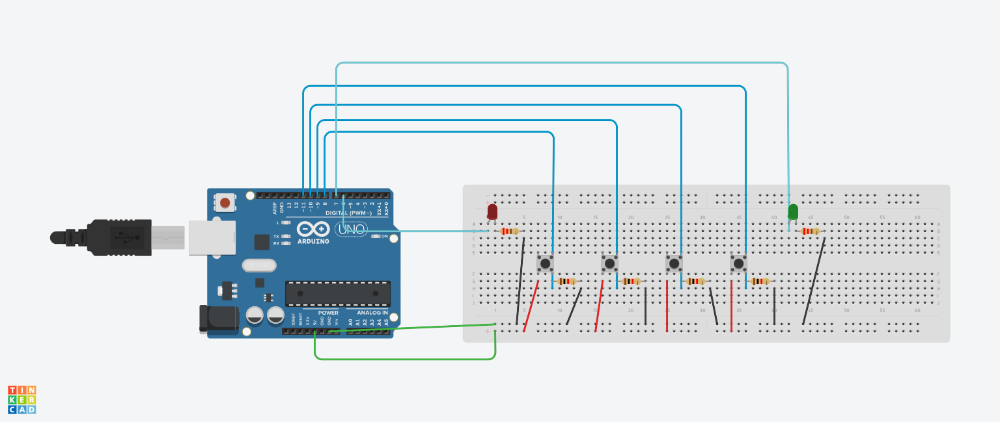

# Arduino Sequence Authenticator

A basic Arduino-based authentication system that uses a button press sequence to unlock access. This project demonstrates input handling, state logic, and hardware interaction through LEDs and buttons, a practical example of embedded systems and microcontroller programming.

## 🔧 Features

- Four-button input system with a predefined unlock sequence
- Real-time feedback via LEDs (green for success, red for failure)
- Sequence timeout and reset logic
- Basic debounce handling
- Simple, modular structure ready for expansion

## 🖼️ Circuit Diagram

## 🧠 How It Works

1. The user is required to press a specific button sequence:
   `Button 1 → Button 3 → Button 4 → Button 2`
2. Each correct press advances the sequence.
3. A wrong button or timeout resets the system and triggers a red LED blink (failure).
4. Successful input triggers the green LED and resets the system.

## ⏱️ Timeout & Reset

- If the user takes more than 10 seconds to complete the sequence, it resets and shows a failure signal.
- After either success or failure, the system is ready for a new attempt.

## 📦 Components Used

- 1 × Arduino Uno R3
- 4 × Push buttons
- 2 × LEDs (Red and Green)
- 2 × 220Ω resistors (for LEDs)
- 4 × 1kΩ pull-down resistors
- Breadboard and jumper wires

## 🧰 Setup

1. Connect buttons to digital pins **8–11**.
2. Connect red LED to **pin 6**, green LED to **pin 7** (via resistors).
3. Upload the `sequence-auth.ino` sketch to your Arduino.
4. Power it and test the sequence.

## 🔗 Tinkercad Simulation

[View this circuit on Tinkercad](https://www.tinkercad.com/things/2DEtRwbYuad-session1-challenge-ym?sharecode=IcIM3OoJs6X5k0-VywizAluijfKhopPUKAznOpfk0gg)

## License:

This project is licensed under <b>MIT License</b>.

